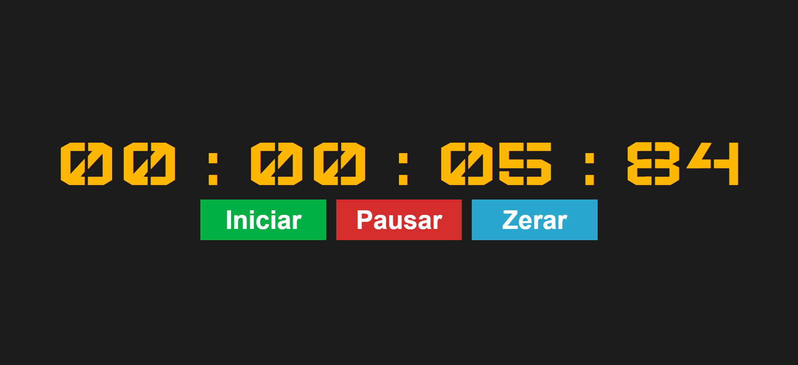

# stopwatch

This project is a stopwatch that counts time in the format Hour:Minute:Second:Tenth.

The project was used for personal front end studies using only the HTML, CSS and Vanilla JS languages.

You can see in the image below what the developed page looks like:

